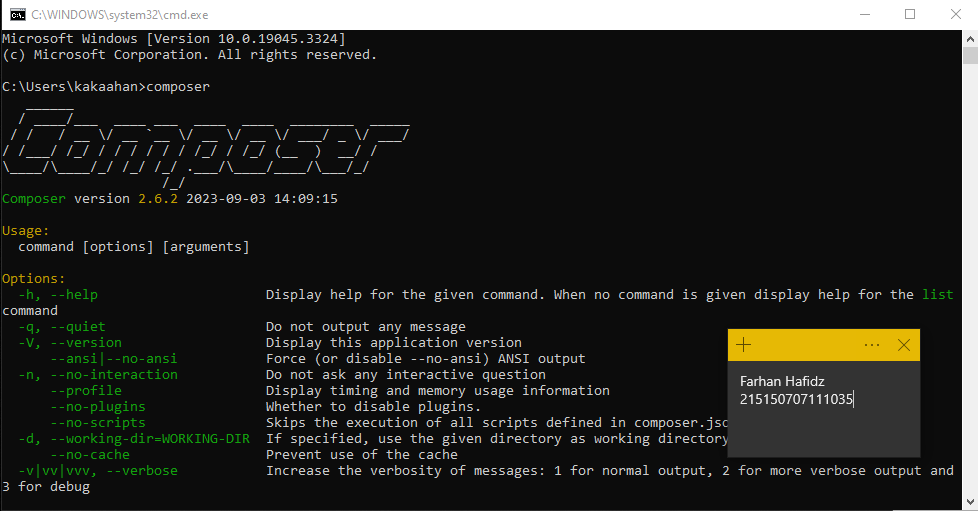
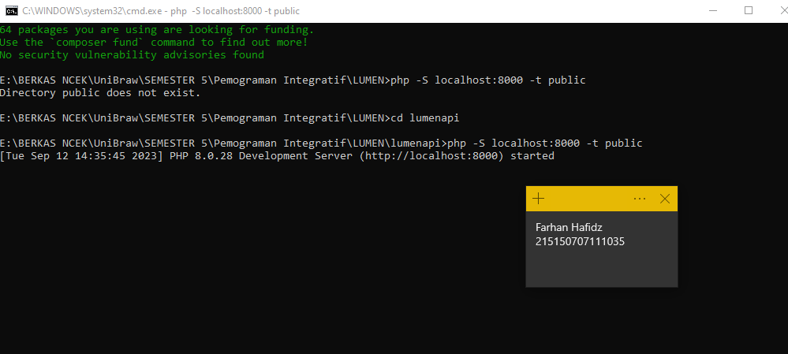
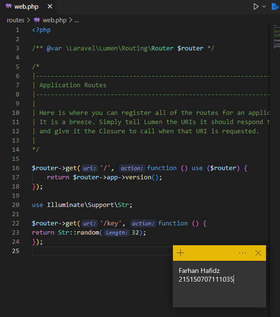
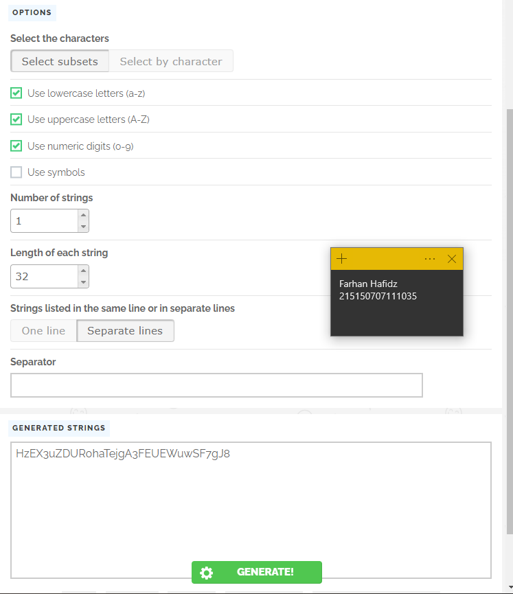

# Instalasi Lumen, MongoDB, dan Konfigurasi App Key

NO 1)
Percobaan instalasi Composer

NO 2)
Melakukan instalasi MongoDB seperti pada langkah-langkah di Modul praktikum

NO 3)
Percobaan Instalasi Lumen :

Melakukan instalasi lumen dimulai dengan mempersiapkan folder yang diinginkan dan 
meng-copy-kan pathnya, lalu membuka cmd dan masuk kepada direktori seperti path 
yang telah kita copy, selanjutnya menjalankan perintah instalasi seperti yang ada pada 
bagian di atas, dan terakhir menjalakankan project lumen yang berhasil terinstall.

NO 4)
Konfigurasi APP_KEY:

Melakukan konfigurasi APP_KEY yang diperlukan pada lumen, yang berfungsi untuk 
pengamanan aplikasi kita. Langkah konfigurasi dimulai dari membuka file web.php dan 
menambahkan endpoint bertipe string dengan panjang 32, lalu membuka website random 
string generator untuk mendapatkan string random, selanjutnya memasukkan string random 
yang telah didapat ke file .env pada bagian APP_KEY